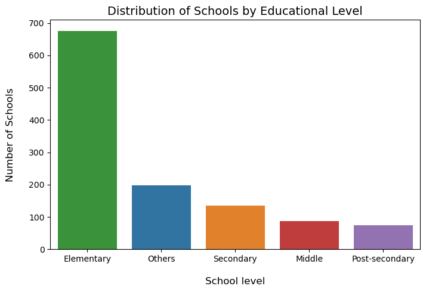
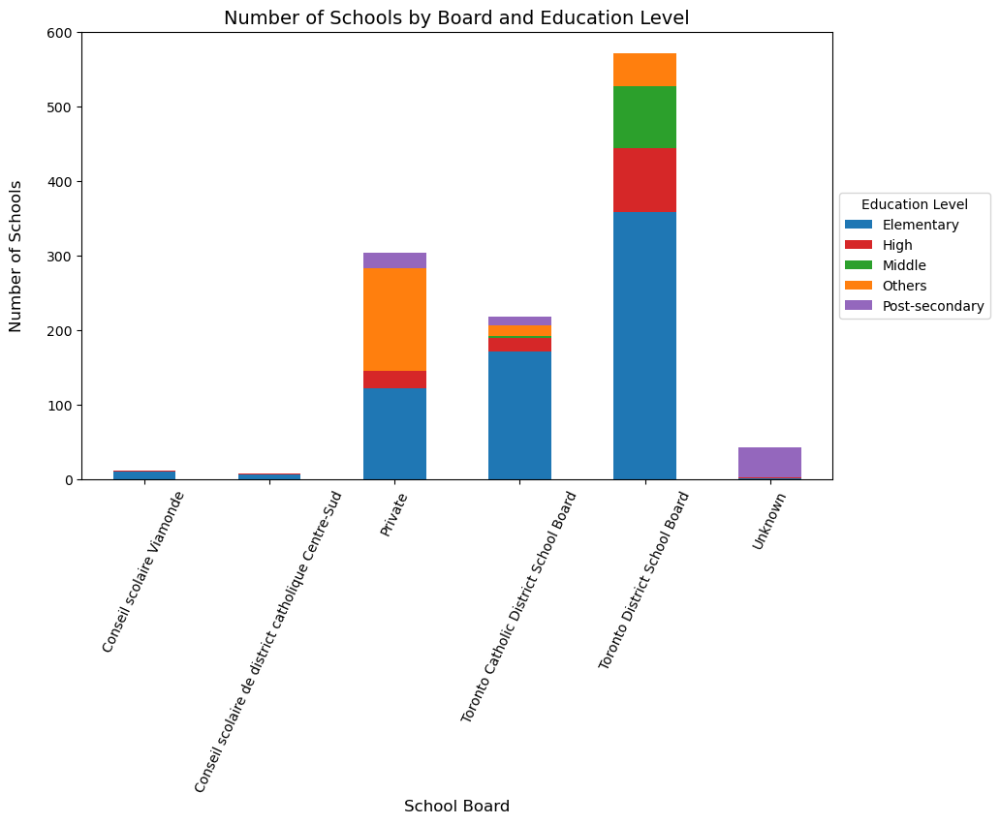
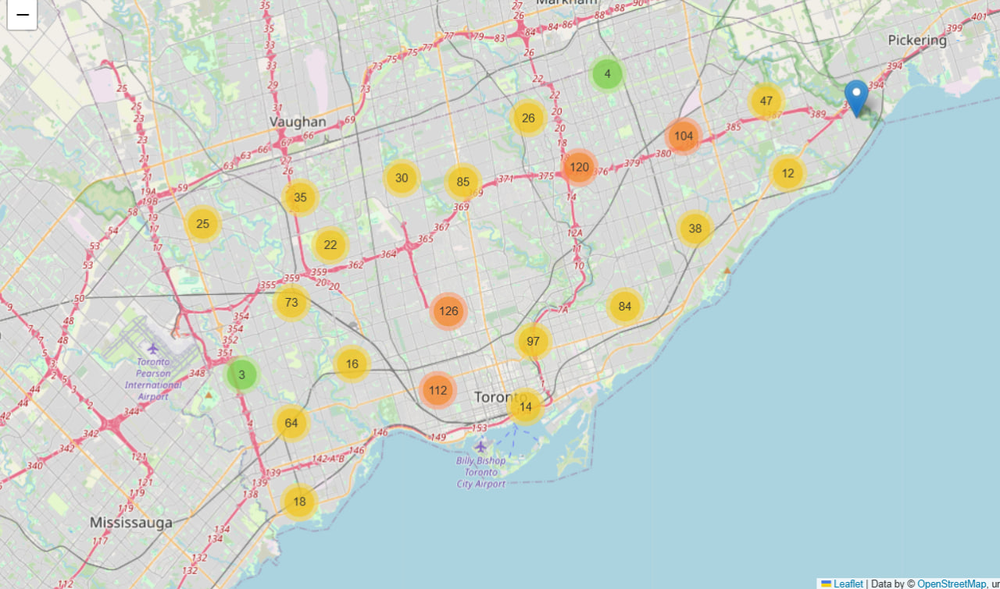
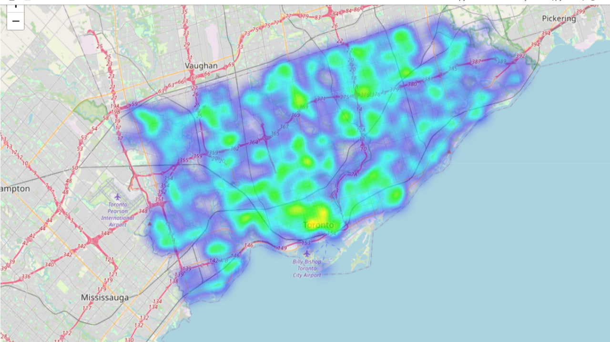

# Toronto Schools Analysis

This project analyzes the distribution of schools across the City of Toronto, with a focus on accessibility, educational levels, governance types, and geographic patterns.
The notebook demonstrates skills in data cleaning, exploratory data analysis (EDA), visualization, and spatial analysis.

## Project Goals

- Practice data wrangling and preprocessing on real-world datasets.

- Conduct exploratory data analysis (EDA) to identify patterns.

- Visualize spatial and categorical distributions of schools.

- Provide insights useful for city planning, parents, and policymakers.


## Dataset
Source: [Toronto Open Data Portal](https://open.toronto.ca/dataset/school-locations-all-types/)

Dataset used: School Locations – All Types

Content: Names, addresses, governance boards, geographic coordinates, and types of schools across Toronto.


## Tools & Libraries

- Python (numpy, pandas, geopandas, matplotlib, seaborn)

- Folium (interactive maps)

- Jupyter Notebook


## Visualizations

Below are a few sample charts and maps from the project. The full set of visualizations, along with detailed explanations, can be found in the Jupyter Notebook.

### Distribution of Schools by Educational Level


### Number of Schools by Board and Education Level


### Interactive School Map (Folium)
  
🔗 [View full interactive map](visuals/toronto_schools_interactive_map.html)

### School Density Heatmap (Folium)
  
🔗 [View full interactive map](https://yourusername.github.io/toronto-schools-map/toronto_schools_heatmap.html)


## Key Insights

- Elementary schools are the most common type in Toronto.

- School distribution is uneven, with higher density in central and north-eastern neighborhoods.

- Most elementary and secondary schools fall under the Toronto District School Board and the Toronto Catholic District School Board, while private institutions exhibit broader presence across all levels, including post-secondary. Francophone boards are represented with fewer schools overall, suggesting more localized or specialized governance.


## How to Run:

```
git clone https://github.com/your-username/toronto-schools-analysis.git
cd toronto-schools-analysis

pip install -r requirements.txt

jupyter notebook project.ipynb
```

This is my first portfolio project in Data Science.  
I was curious to explore how schools are distributed across Toronto, how they differ by type, accessibility, and governance. Through this project, I gained hands-on experience with data wrangling, exploratory analysis, and geospatial visualization.

I am actively building my career as a Junior Data Scientist and am always open to feedback, collaboration, and new ideas.


Contact: anastasiia.slavina.w@gmail.com

LinkedIn: [Anastasiia Slavina](https://www.linkedin.com/in/anastasiia-slavina/)
